# CBSS Report Diagrams

This file contains report-ready diagrams for the Campus Bike Sharing System (CBSS).

---

## 1. Overall System Architecture

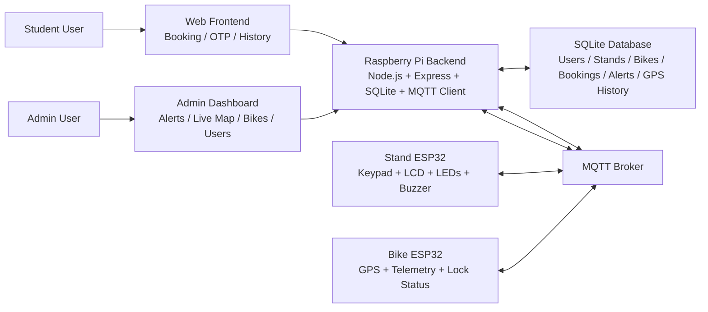

---

## 2. Layered IoT Architecture

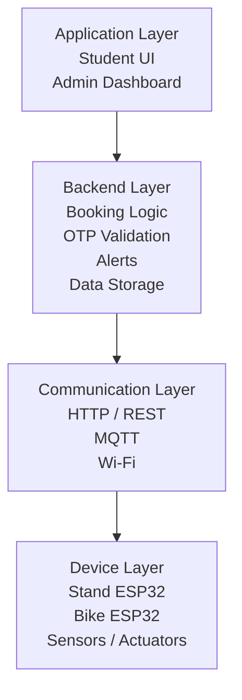

---

## 3. Network Topology

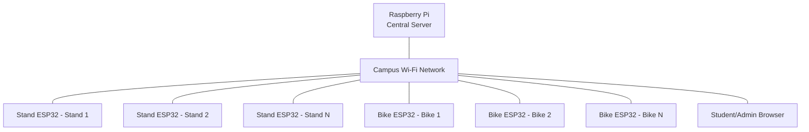

---

## 4. Booking and OTP Unlock Flowchart

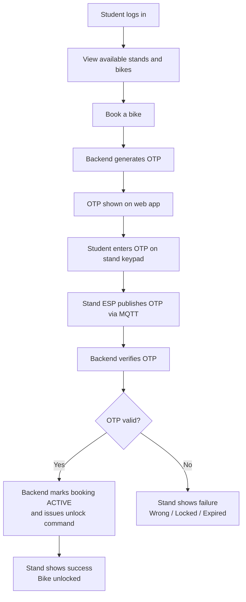

---

## 5. Real-Time Bike Tracking Flow

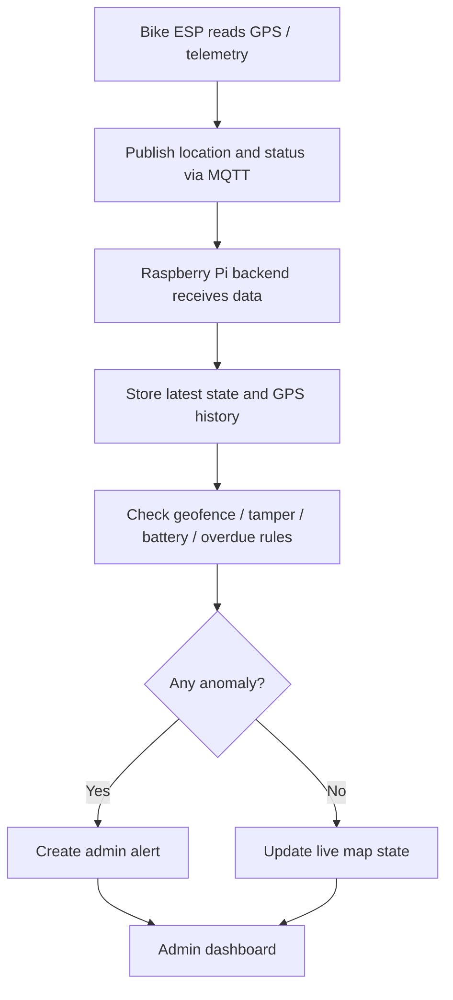

---

## 6. Sequence Diagram for OTP Verification

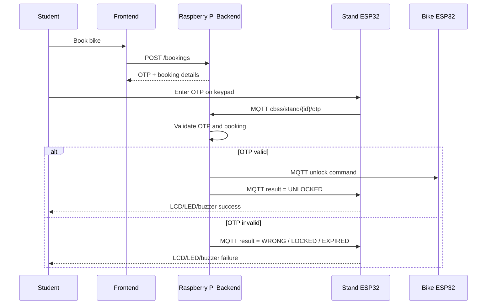

---

## 7. Data Flow Diagram

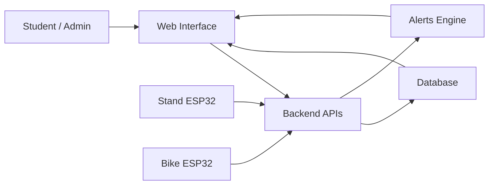

---

## 8. Database Entity Relationship Diagram

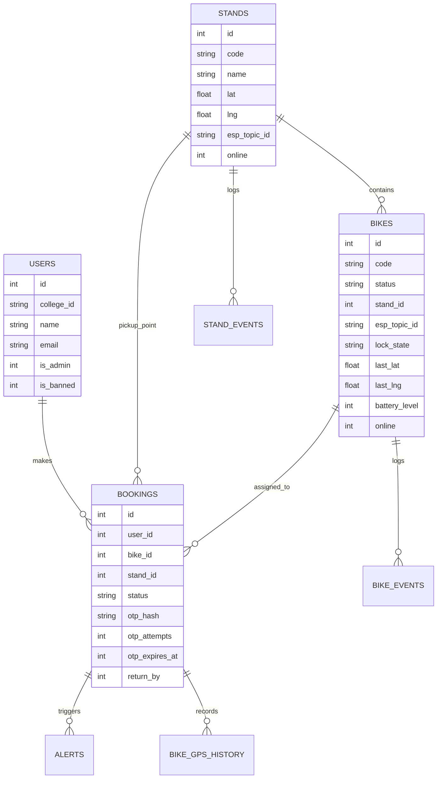

---

## 9. Stand Prototype Hardware Block Diagram

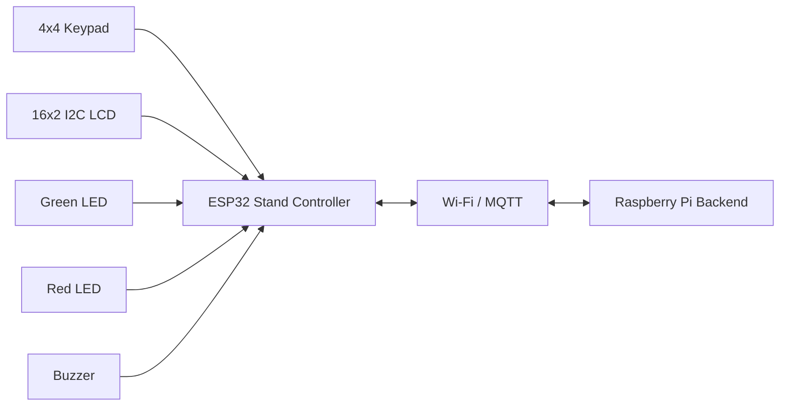

---

## 10. Planned Bike Hardware Block Diagram

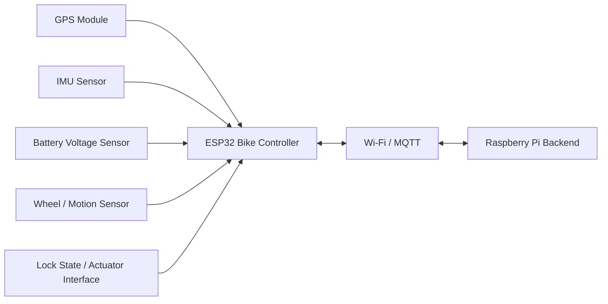

---

## 11. Planned 12-Sensor / 12-Telemetry Stack

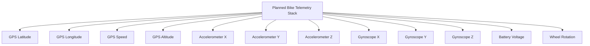

---

## 12. Project Status Chart

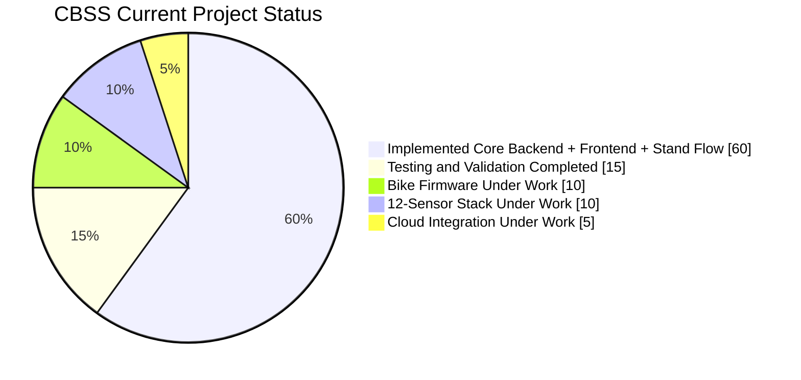

---

## 13. Module Completion Graph

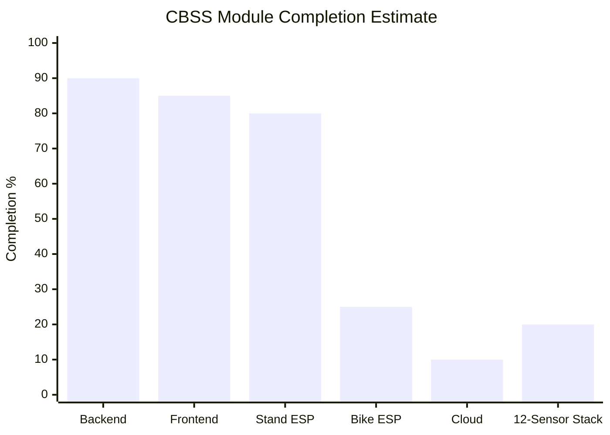

---

## 14. Testing Flowchart

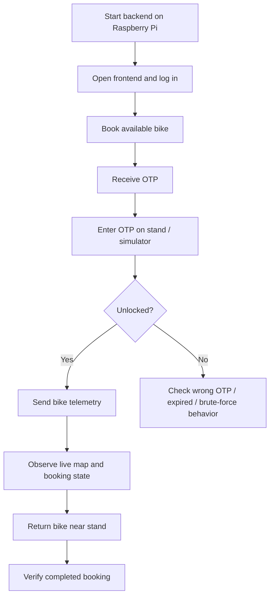

---

## 15. Alert Handling Flowchart

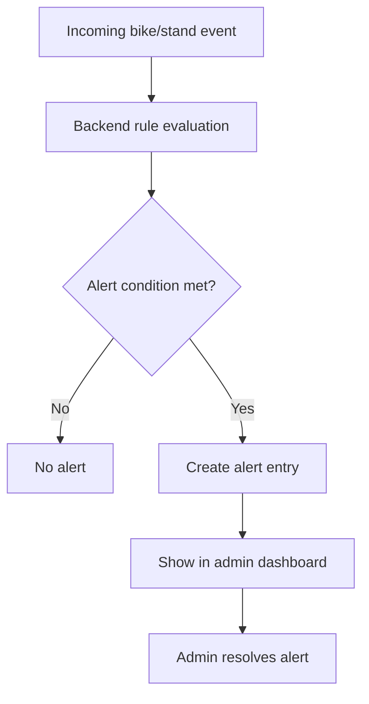

---

## 16. Suggested Figure List for the Report

You can cite the diagrams in the report as:

- Figure 1: Overall System Architecture
- Figure 2: Layered IoT Architecture
- Figure 3: Network Topology
- Figure 4: Booking and OTP Unlock Flowchart
- Figure 5: Real-Time Bike Tracking Flow
- Figure 6: OTP Verification Sequence Diagram
- Figure 7: Database ER Diagram
- Figure 8: Stand Hardware Block Diagram
- Figure 9: Planned Bike Hardware Block Diagram
- Figure 10: Planned 12-Sensor / 12-Telemetry Stack
- Figure 11: Project Status Chart
- Figure 12: Module Completion Graph
